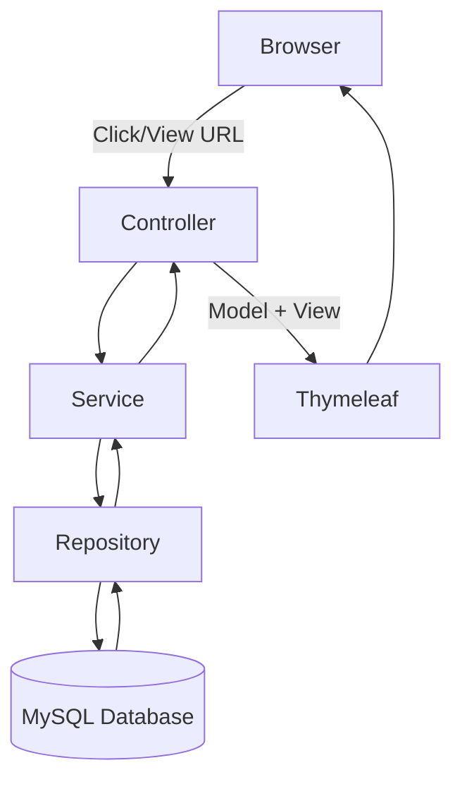

# TodoApp

A simple **Spring Boot + Thymeleaf** application to manage a list of tasks (TODOs). This README will guide you step-by-step—**from zero Spring knowledge** to running and extending the app.

---

## 🛠 Prerequisites

Before you begin, make sure you have:

* **Java 17** (or later) installed and `JAVA_HOME` configured.
* **Maven** (or use the provided wrapper `./mvnw`).
* **IDE**: IntelliJ IDEA (Community or Ultimate).
* **MySQL** server running locally.
* (Optional) **MySQL Workbench** or any GUI client.

---

## 1. Generate Your Project Skeleton

1. Go to [start.spring.io](https://start.spring.io)
2. Configure:

    * **Project**: Maven
    * **Language**: Java
    * **Spring Boot**: Latest 2.x or 3.x release
    * **Group**: `com.app`
    * **Artifact**: `todoapp`
    * **Dependencies**:

        * Spring Web
        * Thymeleaf
        * Spring Data JPA
        * MySQL Driver
        * (Optional) Lombok
3. Click **Generate**, download the ZIP, and unzip it.

---

## 2. Open in IntelliJ IDEA

```bash
→ Launch IntelliJ IDEA
→ Click "Open"
→ Navigate to the unzipped `todoapp` folder
→ Select it (or `pom.xml`) and click "Open"
```

> IntelliJ will import the Maven project and download dependencies automatically.

---

## 3. Create the MySQL Schema

Use Workbench or CLI to create your database:

```sql
CREATE SCHEMA `todo-app`
  CHARACTER SET utf8mb4
  COLLATE utf8mb4_unicode_ci;
```

---

## 4. Configure Database Connection

Edit `src/main/resources/application.properties`:

```properties
spring.application.name=todoapp

# MySQL connection
spring.datasource.url=jdbc:mysql://localhost:3306/todo-app
spring.datasource.username=YOUR_DB_USER
spring.datasource.password=YOUR_DB_PASSWORD

# JPA / Hibernate
spring.jpa.hibernate.ddl-auto=update
spring.jpa.properties.hibernate.dialect=org.hibernate.dialect.MySQLDialect
```

> 🔑 Replace `YOUR_DB_USER` and `YOUR_DB_PASSWORD` accordingly.

---

## 5. Run the Application

Two easy options:

* **Maven Wrapper**

  ```bash
  ./mvnw spring-boot:run
  ```
* **From IntelliJ**

    * Locate `TodoappApplication.java` in `com.app.todoapp`
    * Right‑click → **Run 'TodoappApplication.main()'**

Once you see **"Started TodoappApplication"**, visit:

```
http://localhost:8080/
```

---

## 6. Project Structure Overview

```text
src
└── main
    ├── java
    │   └── com.app.todoapp
    │       ├── controller
    │       │   └── TaskController.java    ← Handles web requests
    │       ├── models
    │       │   └── Task.java              ← JPA entity
    │       ├── repository
    │       │   └── TaskRepository.java    ← Data access
    │       ├── services
    │       │   └── TaskService.java       ← Business logic
    │       └── TodoappApplication.java   ← Main entry point
    └── resources
        ├── static       ← CSS, JS, images
        ├── templates    ← Thymeleaf HTML files
        │   └── tasks.html
        └── application.properties
```

---

## 7. How a Web Request Flows in Spring Boot

1. **User clicks a button or visits a URL** (e.g. **"View Tasks"**).
2. **Spring DispatcherServlet** routes the request to the matching **Controller** method.
3. **Controller** (`TaskController`) calls the **Service** (`TaskService`).
4. **Service** applies business logic, then calls the **Repository** (`TaskRepository`) to fetch or save data.
5. **Repository** interacts with the **MySQL database** via JPA/Hibernate.
6. Data returns back up: Repository → Service → Controller.
7. **Controller** returns a **view name** (`tasks.html`) and a **Model** containing data.
8. **Thymeleaf** renders the HTML, injecting data into the template.
9. The fully rendered HTML is sent back to the **browser**.



---

## 8. Example REST Endpoint

Although we use Thymeleaf for UI, you can also expose a JSON API. Example in `TaskController.java`:

```java
@RestController
@RequestMapping("/api/tasks")
public class TaskRestController {

    private final TaskService taskService;

    public TaskRestController(TaskService taskService) {
        this.taskService = taskService;
    }

    // GET /api/tasks
    @GetMapping
    public List<Task> getAllTasks() {
        return taskService.getAllTasks();
    }

    // POST /api/tasks
    @PostMapping
    public Task createTask(@RequestBody Map<String, String> payload) {
        String title = payload.get("title");
        taskService.createTask(title);
        return taskService.getAllTasks().get(...); // return newly created
    }
}
```

* **GET** `/api/tasks` → returns JSON list of tasks.
* **POST** `/api/tasks` → create a new task by sending `{ "title": "Buy milk" }`.

---

##
